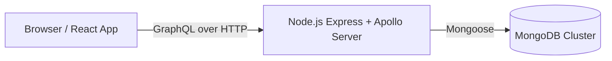
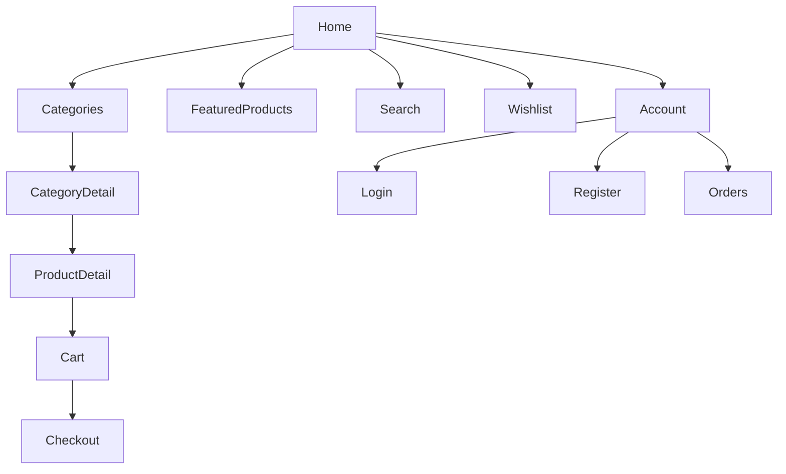
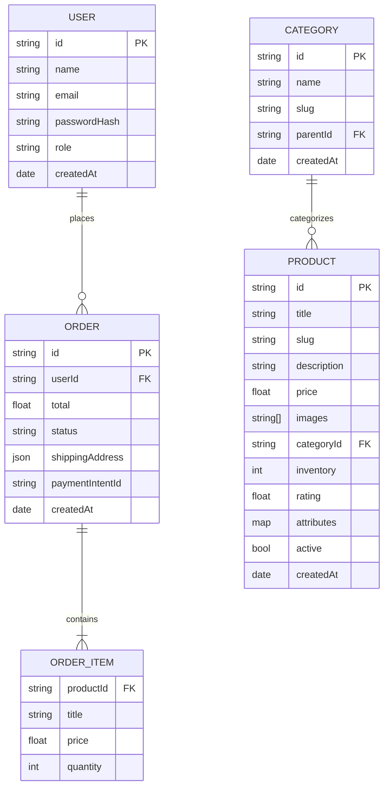

# E-commerce GraphQL Server (Node.js + MongoDB)

This backend adds a GraphQL API for your React storefront using Node.js, Apollo Server, Express, and MongoDB (via Mongoose). All JavaScript (no TypeScript), matching your project constraints.

## Quick start

1. Copy environment file

```bash
cp .env.example .env
```

Edit `.env` with your MongoDB connection string, DB name, and a JWT secret.

2. Install and run

```bash
npm install
npm run seed   # optional: seed sample categories/products
npm run dev
```

GraphQL endpoint runs at:

- http://localhost:4000/graphql

Try this sample query in your GraphQL client:

```graphql
query Products {
  products(pagination: { page: 1, pageSize: 12 }) {
    id
    title
    price
    category {
      id
      name
      slug
    }
  }
}
```

## Auth

- Register: `registerUser(name, email, password)` returns `{ token, user }`.
- Login: `loginUser(email, password)` returns `{ token, user }`.
- Use `Authorization: Bearer <token>` header for authenticated queries/mutations.
- Admin-only mutations: `createProduct`, `updateProduct`, `deleteProduct`, `createCategory` (set the user `role` to `admin` manually in DB if needed).

## Collections (MongoDB)

- `users` — auth and profile
- `categories` — product taxonomy (self-referencing parent)
- `products` — catalog items (refs `categories`)
- `orders` — orders for users with embedded `items`

## Scripts

- `npm run dev` — start server with hot reload
- `npm run start` — start server
- `npm run seed` — seed DB with example data

---

# Diagrams

Below are Mermaid diagrams. You can paste them into a Mermaid editor (e.g., https://mermaid.live) to render them.

## System architecture



## Website sitemap



## Database model (MongoDB)



---

# Frontend integration (Apollo Client)

Install in your frontend project (optional):

```bash
npm i @apollo/client graphql
```

Create `src/lib/apolloClient.js`:

```js
import { ApolloClient, InMemoryCache, HttpLink } from "@apollo/client";

export const client = new ApolloClient({
  link: new HttpLink({ uri: "http://localhost:4000/graphql" }),
  cache: new InMemoryCache(),
});
```

Wrap your app in `main.jsx`:

```jsx
import { ApolloProvider } from "@apollo/client";
import { client } from "./lib/apolloClient";

// ...
<React.StrictMode>
  <ApolloProvider client={client}>
    <App />
  </ApolloProvider>
</React.StrictMode>;
```

Example query in a component:

```jsx
import { gql, useQuery } from "@apollo/client";

const PRODUCTS = gql`
  query Products($page: Int, $pageSize: Int) {
    products(pagination: { page: $page, pageSize: $pageSize }) {
      id
      title
      price
    }
  }
`;

export function ProductsGrid() {
  const { data, loading, error } = useQuery(PRODUCTS, {
    variables: { page: 1, pageSize: 12 },
  });
  if (loading) return <div>Loading…</div>;
  if (error) return <div>Error: {error.message}</div>;
  return (
    <div className="grid grid-cols-2 md:grid-cols-4 gap-4">
      {data.products.map((p) => (
        <div key={p.id} className="border p-3 rounded-md">
          <div className="font-medium">{p.title}</div>
          <div>
            ${"{"}p.price{"}"}
          </div>
        </div>
      ))}
    </div>
  );
}
```

---

## Admin access and headers

Some mutations are admin-only: `createProduct`, `updateProduct`, `deleteProduct`, `createCategory`.

1. Register or login to obtain a JWT token via `registerUser` or `loginUser`.
2. Promote that user to admin:

```bash
npm run make-admin -- --email=user@example.com
```

3. In Apollo Sandbox, set the header so the server recognizes you:

```json
{
  "Authorization": "Bearer <YOUR_JWT_TOKEN>"
}
```

Now you can run, for example:

```graphql
mutation {
  createCategory(name: "New Category") {
    id
    name
    slug
  }
}
```
